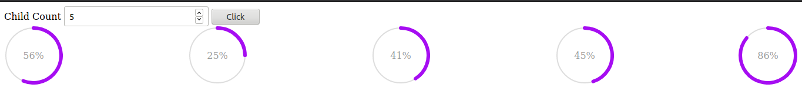

### Starting the project

``` bash
# install dependencies
npm install

# serve 
http-server
````



[Circle Progress Library](https://github.com/tigrr/circle-progress)

````
Starting up http-server, serving ./
Available on:
    http://127.0.0.1:8080
    http://192.168.0.107:8080
Hit CTRL-C to stop the server
````